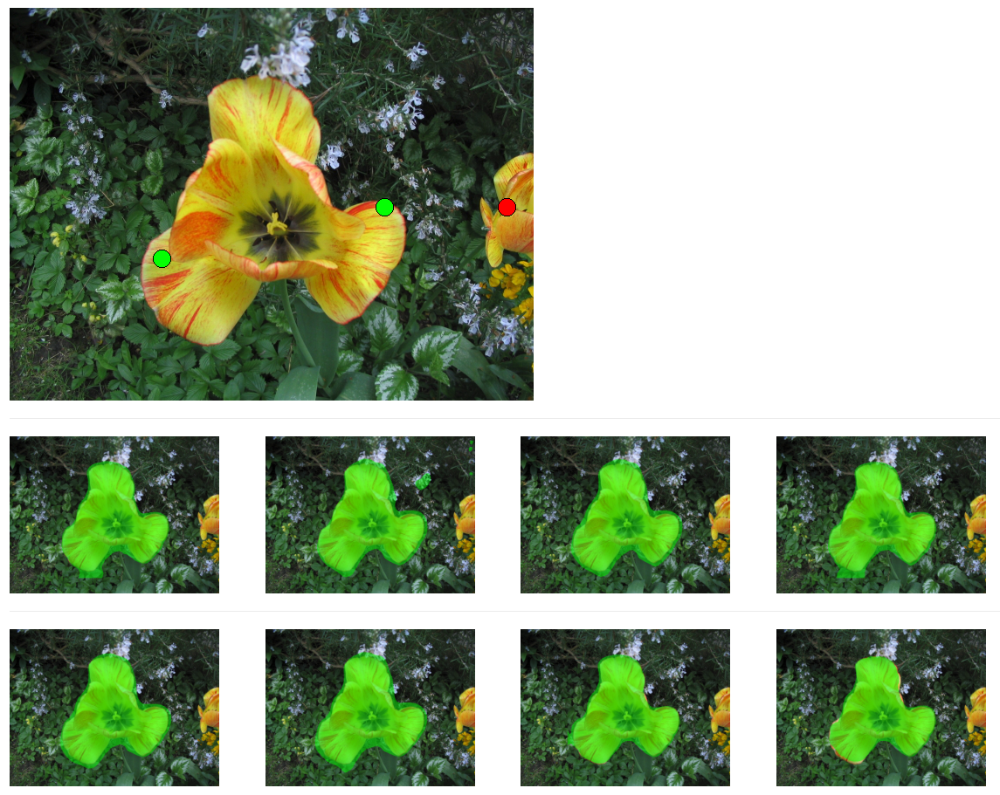

# Click Carving: Segmenting Objects in Videos with Point Clicks 

Suyog Jain and Kristen Grauman
suyog@cs.utexas.edu

This python implementation assumes that the proposals have been pre-computed.

Please download some sample images/video frames along with pre-computed proposals from the following link:
https://drive.google.com/open?id=1XK67Y-dWykATeMHh1K0rpAuZgQRNACOs

Assuming that you uncompressed the dataset folder inside the current folder, you can run click carving in the following
way:

python click_carving.py dataset/ <image_name>

Example:
python click_carving.py dataset/ flower.jpg

1) Please use left mouse to provide positive clicks on the  object of interest. Clicks can be placed anywhere on the
object, but we have found that boundary clicks are much more discriminative. 

2) Please use the right click to provide negative clicks. 

The positive clicks are shown in green, the negative ones are shown in red.

After each click, you should see an updated reranking. 

Screenshot:

[1] Suyog Jain, Kristen Grauman, “Click Carving: Segmenting Objects in Video with Point Clicks”, Fourth AAAI Conference on Human Computation and Crowdsourcing (HCOMP), 2016. 

